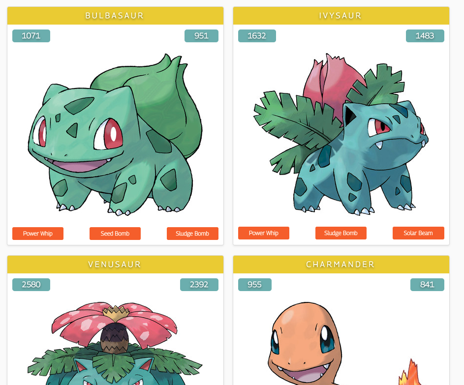

## graphql_react_pokemon
> this app helps you find pokemon abilities using graphql

Inspired by Karl Hadwen's [tutorial](https://www.youtube.com/watch?v=yKFoAF7J0mc). 

Modified to include random generation of weird and wonderful Pokémon.

Tech: react-gh-pages, graphql, pokeapi
